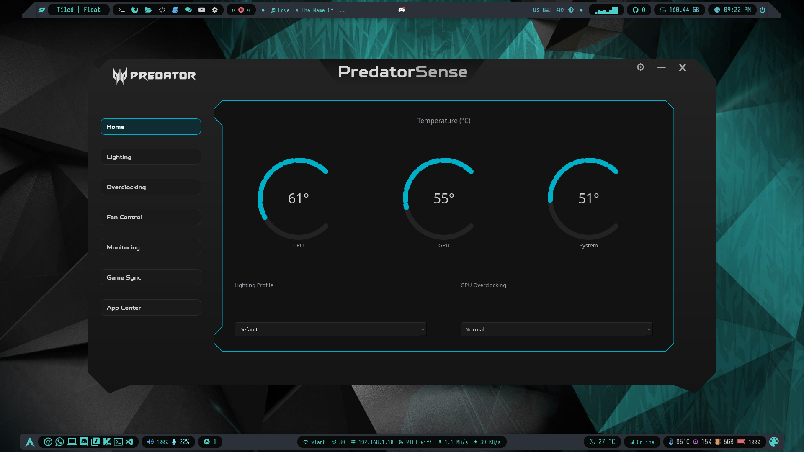

# PredatorSense-Linux
PredatorSense GUI App Implementation For Linux



### The GUI App For [**`Linuwu-Sense`**](https://github.com/0x7375646F/Linuwu-Sense)

> **Note:** Recommended to use this Fork [**`mmsaeed509/Linuwu-Sense`**](https://github.com/mmsaeed509/Linuwu-Sense) as it supports more models.

Install dependencies

```shell
pip install -r requirements.txt  
```

run App

```shell
python main.py
```