# PredatorSense-Linux

A modern, feature-rich GUI implementation of PredatorSense for Linux systems, bringing the full Acer Predator experience to Linux users.


## About

This is a GUI application for [**Linuwu-Sense**](https://github.com/0x7375646F/Linuwu-Sense), providing a native Linux interface for controlling your Acer Predator/Nitro laptop's hardware features.

> **Note:** For better hardware compatibility, we recommend using [**mmsaeed509/Linuwu-Sense**](https://github.com/mmsaeed509/Linuwu-Sense) fork which supports more models.

## Features

### 🏠 System Monitoring
Real-time monitoring of CPU, GPU, and system temperatures with elegant circular gauges.

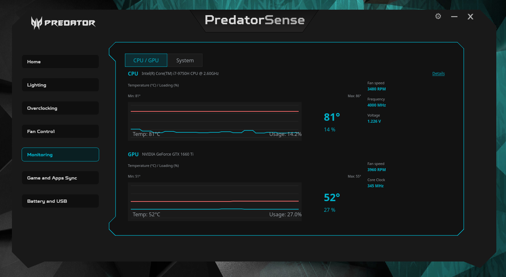

### 💡 RGB Keyboard Lighting Control

#### Static Mode
Per-zone color customization with 4 independent zones.

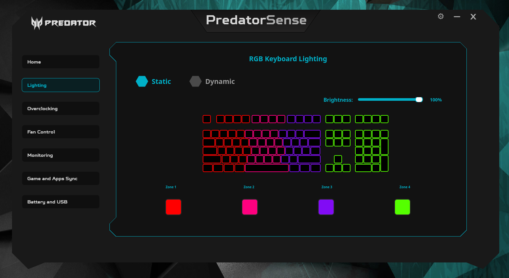

#### Dynamic Mode
Multiple lighting effects including Breathing, Shifting, Wave, Neon, and Zoom with customizable speed, direction, and colors.

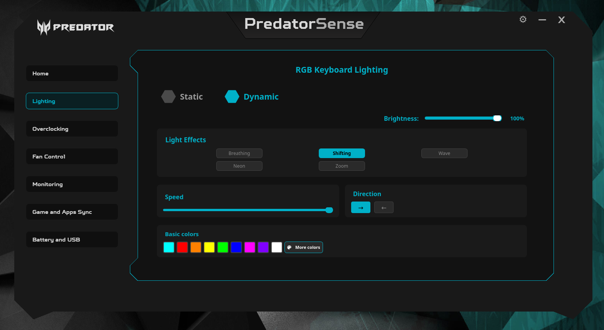

#### Color Picker
Dark-themed color picker dialog matching the PredatorSense aesthetic.

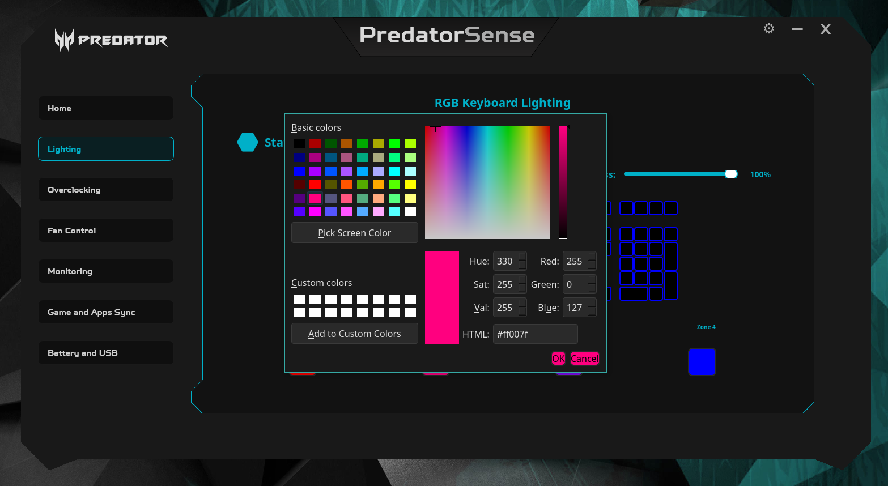

### 🌀 Fan Control

#### Auto Mode
Automatic fan speed control based on system temperature.

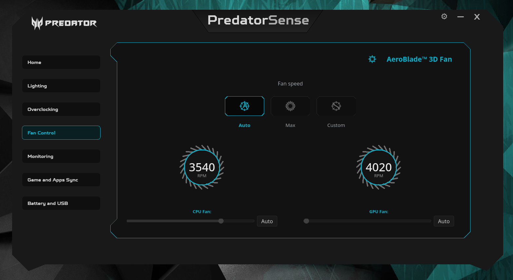

#### Custom Profiles
Create and manage custom fan curves for optimal cooling and noise balance.


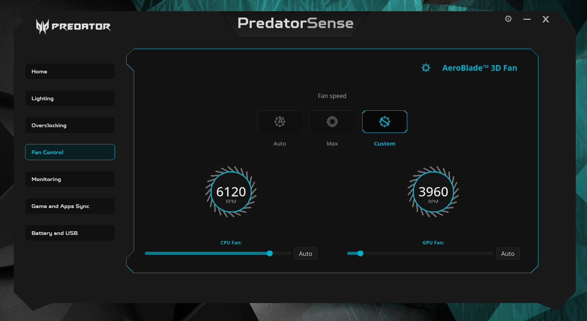

#### Max Mode
Maximum cooling performance for intensive workloads.

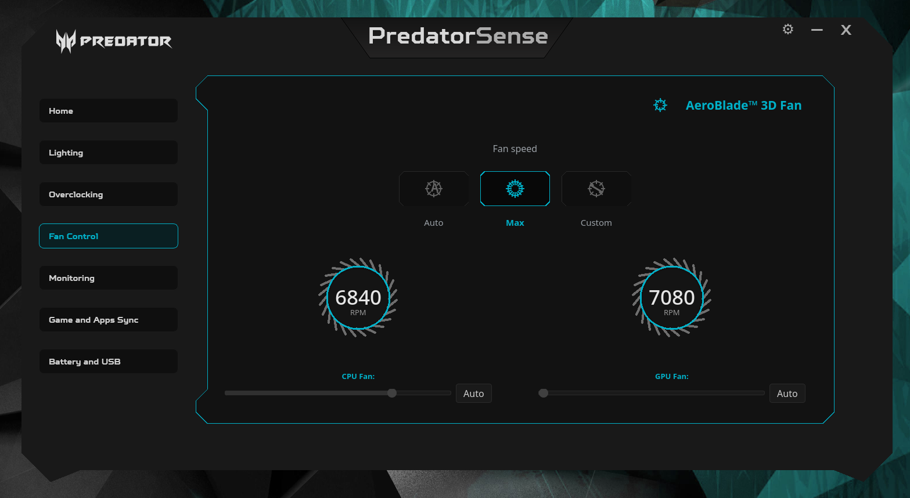

### 📊 Advanced Monitoring
Detailed system metrics including CPU/GPU usage, temperatures, fan speeds, and more.

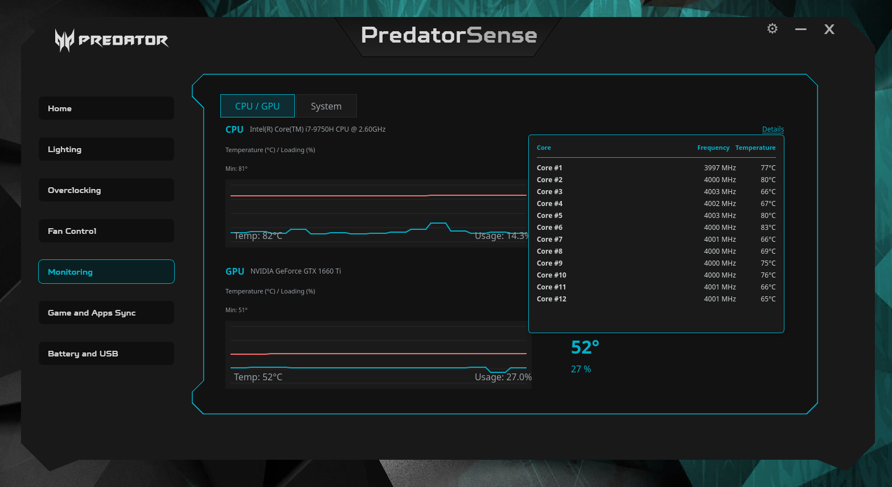
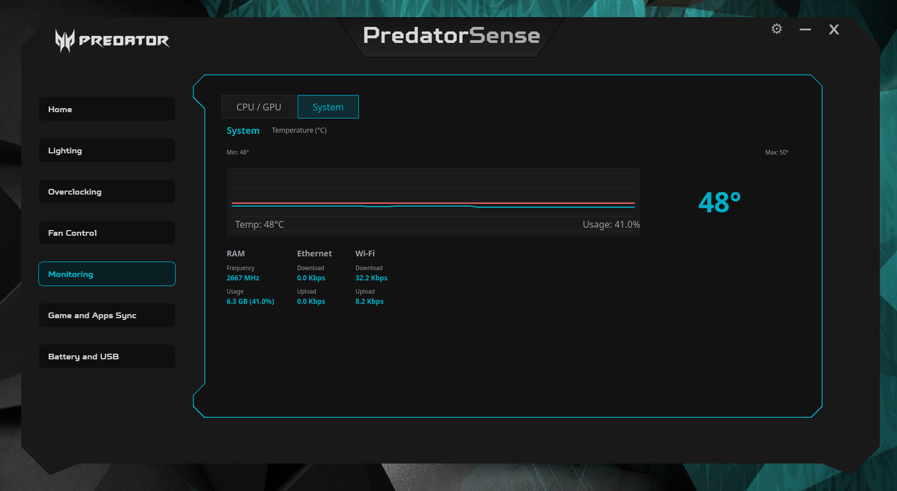

### ⚡ GPU Overclocking
Easy GPU overclocking profiles (Normal, Fast, Extreme) for enhanced gaming performance.

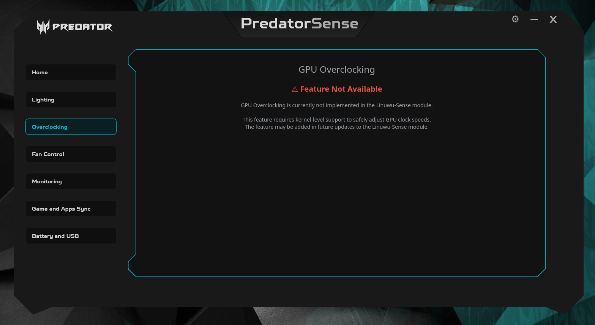

### 🔋 Battery Management

#### Battery Limiter
Extend battery lifespan by limiting charge to 80%.

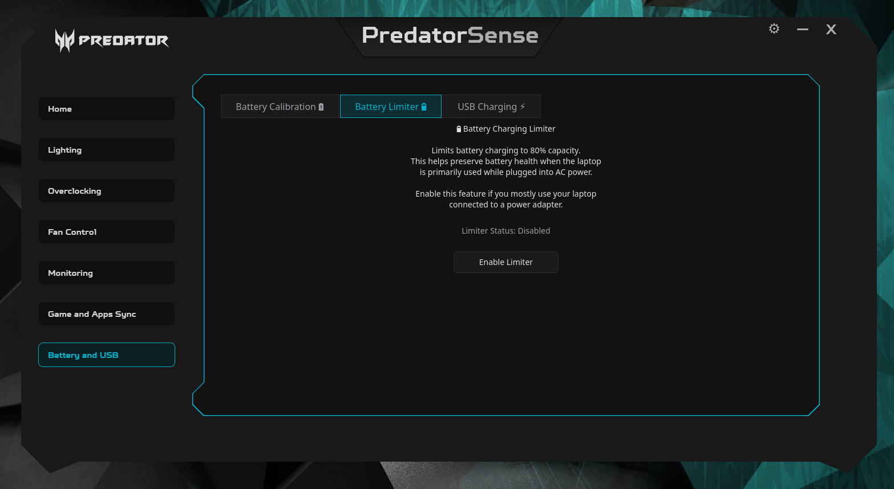

#### Battery Calibration
Calibrate your battery for accurate charge reporting.

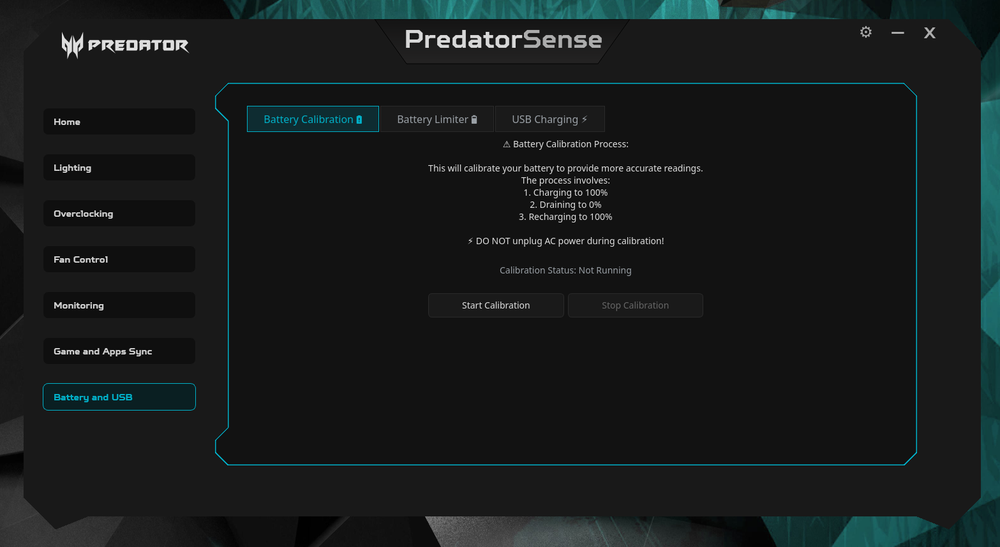

### 🔌 USB Charging Control
Enable/disable USB charging when the laptop is powered off.

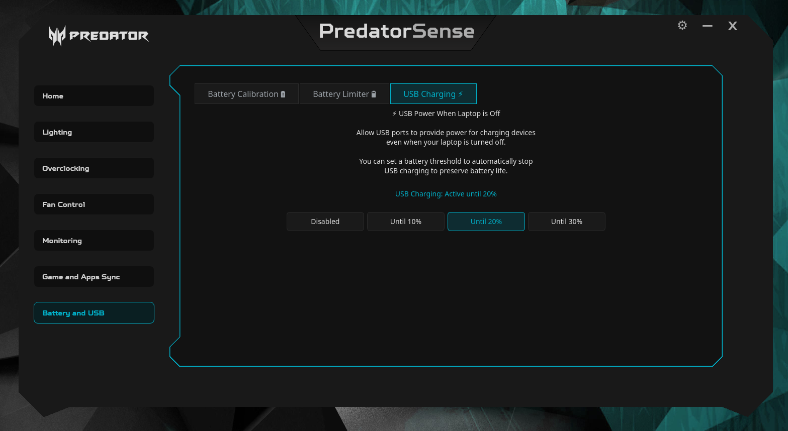

### 🎮 Game and Apps Sync
Automatic profile switching based on running applications (Coming Soon).

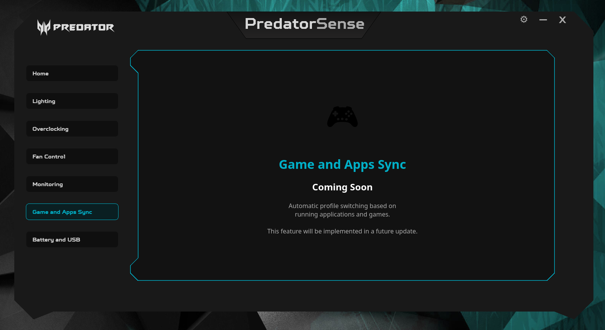

### ⚙️ Settings
Temperature unit switching (Celsius/Fahrenheit) and more.

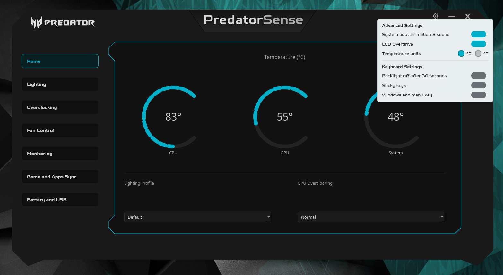

## Installation

### Prerequisites

- Python 3.7 or higher
- PyQt5
- Linuwu-Sense kernel module installed and loaded

### Install Dependencies

```bash
pip install -r requirements.txt
```

### Run Application

```bash
python main.py
```

Or from the src directory:

```bash
python src/main.py
```

## Requirements

- Linux operating system
- Acer Predator laptop (compatible models)
- [Linuwu-Sense](https://github.com/0x7375646F/Linuwu-Sense) kernel module
- Python 3.7+
- PyQt5

## Supported Features

- ✅ Real-time system monitoring (CPU, GPU, System temperatures)
- ✅ RGB keyboard lighting control (Static & Dynamic modes)
- ✅ Fan speed control (Auto, Custom, Max modes)
- ✅ GPU overclocking profiles
- ✅ Battery charge limiting
- ✅ Battery calibration
- ✅ USB charging control
- 🚧 Game and Apps Sync (Coming Soon)

## Contributing

Contributions are welcome! Feel free to submit issues, feature requests, or pull requests.

## Credits

- Based on [Linuwu-Sense](https://github.com/0x7375646F/Linuwu-Sense) by 0x7375646F
- Enhanced fork by [mmsaeed509](https://github.com/mmsaeed509/Linuwu-Sense)

## License

This project follows the same license as Linuwu-Sense.

## Disclaimer

This software interacts with hardware components. Use at your own risk. The developers are not responsible for any hardware damage.
